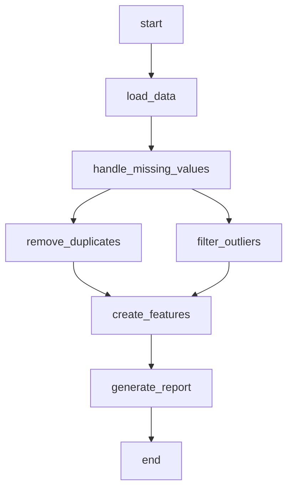

# Backend - MLOps Pipeline con Apache Airflow


## 📋 Descripción del Proyecto

Este repositorio contiene el backend, un sistema MLOps construido con Apache Airflow para la predicción de deserción estudiantil. El proyecto implementa un pipeline automatizado de machine learning que incluye:

- **Orquestación de workflows** con Apache Airflow
- **Pipeline de limpieza de datos** automatizado
- **Entrenamiento y predicción** de modelos ML
- **CI/CD automatizado** con GitHub Actions
- **Despliegue GitOps** en Kubernetes

## 🚀 Características Principales

- ✅ Pipeline ETL automatizado para datos académicos
- ✅ Manejo inteligente de valores faltantes y outliers
- ✅ Creación automática de características derivadas
- ✅ Integración con bases de datos MySQL
- ✅ Reportes automáticos de calidad de datos
- ✅ Despliegue containerizado con Docker
- ✅ CI/CD con GitHub Actions y GitOps

## 🏗️ Estructura del Proyecto

```
egi-backend/
├── .github/
│   └── workflows/
│       └── ci-cd.yaml          # Pipeline CI/CD automatizado
├── dags/
│   ├── mlops_dag.py           # DAG principal del pipeline MLOps
│   └── group_cleaning.py      # Grupos de tareas para limpieza
├── src/
│   └── utils/
│       └── processing.py      # Utilidades de procesamiento de datos
├── volumes/
│   └── airflow/               # Datos persistentes de Airflow
├── docker-compose.yml         # Configuración de servicios locales
├── Dockerfile                 # Imagen Docker optimizada
├── requirements.txt           # Dependencias Python
├── .gitignore                # Archivos ignorados por Git
└── README.md                 
```

## 📦 Dependencias

### Dependencias Python Principales

```python
# Orquestación
apache-airflow==2.9.2

# Machine Learning
scikit-learn
pandas
numpy
joblib

# Visualización
matplotlib
seaborn

# Conectividad
apache-airflow-providers-http
apache-airflow-providers-mysql
PyMySQL

# Utilidades
requests
```

### Dependencias del Sistema

- **Docker** >= 20.10
- **Docker Compose** >= 2.0
- **Python** 3.9
- **MySQL** 8.0

## ⚙️ Configuración del Entorno

### 1. Configuración Local con Docker Compose

```bash
# Clonar el repositorio
git clone https://github.com/Ml-For-Academic-Data/egi-backend.git
cd egi-backend

# Crear estructura de directorios
mkdir -p volumes/airflow
mkdir -p volumes/mysql_data

# Iniciar servicios
docker-compose up -d
```

### 2. Estructura de Datos

El pipeline espera los datos en la siguiente ubicación:
```
/opt/airflow/data/repo-datos/data/raw/dataset.csv
```

Los datos procesados se guardan en:
```
/opt/airflow/data/processed/
/opt/airflow/data/temp/
```

## 🚀 Cómo usar el sistema

### 1. Acceso a la Interfaz Web

Después de ejecutar `docker-compose up -d`:

- **URL**: http://localhost:8080
- **Usuario**: admin
- **Contraseña**: admin

### 2. Ejecutar el Pipeline MLOps

1. En la interfaz de Airflow, busca el DAG `mlops_dropout_prediction`
2. Activa el DAG usando el toggle
3. Ejecuta manualmente con "trigger DAG" o espera la ejecución programada

### 3. Monitoreo del Pipeline

El DAG incluye las siguientes tareas:



### 4. Revisar Resultados

Los resultados se encuentran en:
- **Datos limpios**: `/opt/airflow/data/processed/cleaned_data.csv`
- **Reporte**: `/opt/airflow/data/processed/cleaning_report.txt`

## 🏗️ Despliegue

### Despliegue Local (Desarrollo)

```bash
# Iniciar todos los servicios
docker-compose up -d

# Ver logs
docker-compose logs -f airflow

# Detener servicios
docker-compose down
```

### Despliegue en Producción (Kubernetes)

El proyecto incluye un pipeline CI/CD automatizado que:

1. **Ejecuta pruebas** automáticas con cada push
2. **Construye imagen Docker** y la publica en GHCR
3. **Actualiza automáticamente** los manifiestos de Kubernetes

#### Configuración Requerida

Para el despliegue automatizado, configura estos secrets en GitHub:

```bash
# Token para acceder al repositorio de infraestructura
REPO_ACCESS_TOKEN
```

#### Pipeline de Despliegue

```yaml
# El pipeline se activa automáticamente en:
- Push a rama main
- Pull requests a main

# Flujo:
Test → Build Image → Update K8s Manifests → Deploy
```

## 🧪 Desarrollo

### Ejecutar Pruebas Localmente

```bash
# Instalar dependencias de desarrollo
pip install -r requirements.txt
pip install flake8 pytest

# Ejecutar linting
flake8 . --count --select=E9,F63,F7,F82 --show-source --statistics
```

### Estructura de Desarrollo

```python
# Para agregar nuevas funciones de procesamiento
# Editar: src/utils/processing.py

# Para modificar el pipeline principal
# Editar: dags/mlops_dag.py

# Para cambiar la configuración de servicios
# Editar: docker-compose.yml
```

### Mejores Prácticas

1. **Commits**: Usa conventional commits (`feat:`, `fix:`, `docs:`)
2. **Branching**: Crea feature branches desde `main`
3. **Testing**: Agrega pruebas para nuevas funcionalidades
4. **Documentation**: Actualiza la documentación con cambios importantes

## 🔧 Configuración Avanzada

### Personalizar el Ejecutor de Airflow

Para producción, cambia el ejecutor en `docker-compose.yml`:

```yaml
# Para mayor paralelismo
AIRFLOW__CORE__EXECUTOR=LocalExecutor
# o
AIRFLOW__CORE__EXECUTOR=CeleryExecutor
```

### Configurar Conexiones de Base de Datos

En la interfaz de Airflow:
1. Ve a **Admin** → **Connections**
2. Crea nueva conexión MySQL:
   - **Connection Id**: `mysql_default`
   - **Connection Type**: `MySQL`
   - **Host**: `mysql-server`
   - **Login**: `user`
   - **Password**: `1234`
   - **Schema**: `students`

## 📊 Monitoreo y Logs

### Ver Logs de Contenedores

```bash
# Logs de Airflow Webserver
docker logs airflow

# Logs de Airflow Scheduler
docker logs airflow-scheduler

# Logs de MySQL
docker logs mysql-server
```

### Métricas del Pipeline

El DAG genera automáticamente métricas incluyendo:
- Número de filas procesadas
- Valores faltantes manejados
- Outliers removidos
- Features creadas

**Hecho por el equipo Byte Builders**
